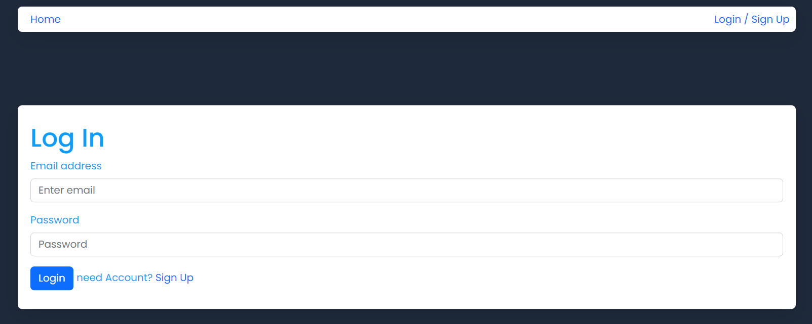

# Todo List App ✅

A Todo List application built using JavaScript, React, Bootstrap, and CSS. This application allows users to register, log in, and manage their tasks efficiently. Users can add, edit, delete, and filter tasks, with tasks being stored securely on the backend.

 

## Developer

|  |
| :----------------------------------------------------------------------------------------: |
|              Sung U Jung [@SungJung0616](https://github.com/SungJung0616)              |

 

## Deployment Address

[Todo List App](https://sj-todo-demo.netlify.app)

## Stacks

### Environment

 

### Config

### Development

   

### Deployment

 

## Features

### JavaScript Utilization

- Fetches user and task data from the backend API.
- Handles user authentication, including registration and login.
- Implements task CRUD operations (Create, Read, Update, Delete).
- Utilizes axios for API requests and interceptors for logging.

### React Utilization

- Components are designed and organized for reusability and manageability.
- State management using useState Hook to track user, tasks, and UI states.
- useEffect Hook to handle data fetching and state updates.
- Props to pass state values for rendering components.
- Implements PrivateRoute for protected routes.

### CSS and Bootstrap Utilization

- The design and responsive work are done using CSS and Bootstrap for a visually appealing interface.
- Uses Bootstrap for layout and styling, ensuring responsive design.
